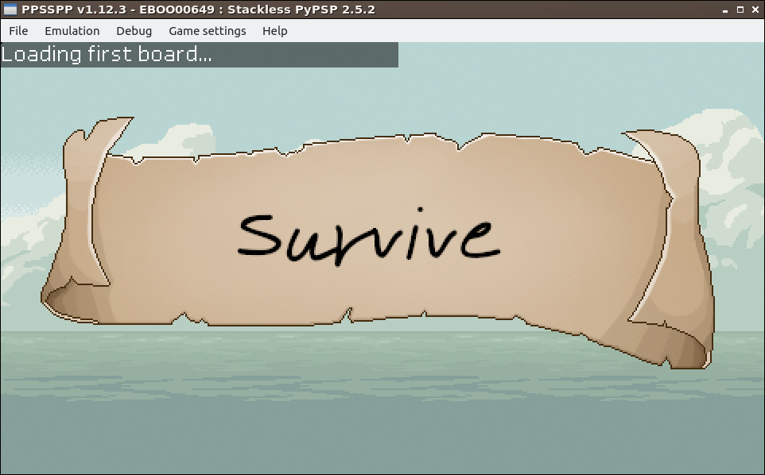

# PSP-SimpleGame
This is a quite simple game on PSP, using Staskless python + PSP2D.

Contact: julien.coron@gmail.com

I would like to try on a some small hardware the game creation. I've started with the fantasy-console Pyxel ("Pyxel is a retro game engine for Python" - https://github.com/kitao/pyxel), but the result was too limited.

Screenshots of the recent update, taken from the PPSSPP emulator (https://www.ppsspp.org/):

## About the content of this repo
In this reposory, you will find:
* The binary file "EBOOT.PBP" (just copied from the strackless python port for PSP) - Find it here: https://code.google.com/archive/p/pspstacklesspython/downloads ;
* The startup script "script.py" ;
* A set of files in the folder "engine". This is the game-engine I've created to provide a kind of framework, to build a RPG game (a zelda-like game) ;
* The "asset" folder contains pictures for the game - See the chapter dedicated to this part, for collision detection ;
* The "conf" filder is the description of the game: how trhe engine have to work with assets to provide a kind of game.

# Documentation
- [Engine](documentation/engine.md)
- [Assets](documentation/assets.md)
- [Configuration](documentation/configuration.md)

# Resources
Thanks to:
- https://opengameart.org/content/pixel-parchment-ui-kit
- https://opengameart.org/content/items10
- https://opengameart.org/content/resouces-pack-1

# Reference
Music API: https://code.google.com/archive/p/pspstacklesspython/wikis/MusicSupport.wiki
